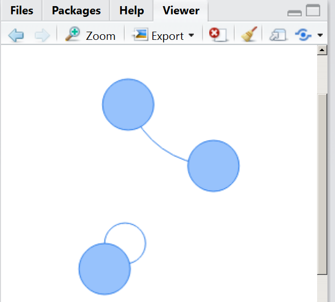

# Netzwerkgraphiken mit visNetwork
Jan-Philipp Kolb  
8 Mai 2017  


## [Einführung in `visNetwork`](https://cran.r-project.org/web/packages/visNetwork/vignettes/Introduction-to-visNetwork.html)

- [Rein kommen](http://datastorm-open.github.io/visNetwork/)


```r
install.packages("visNetwork")
```


```r
library(visNetwork)
```

## Ein Minimalbeispiel


```r
nodes <- data.frame(id = 1:3)
edges <- data.frame(from = c(1,2), to = c(1,3))
visNetwork(nodes, edges, width = "100%")
```

<!--html_preserve--><div id="htmlwidget-62c7105f9e0e9758bc7b" style="width:100%;height:576px;" class="visNetwork html-widget"></div>
<script type="application/json" data-for="htmlwidget-62c7105f9e0e9758bc7b">{"x":{"nodes":{"id":[1,2,3]},"edges":{"from":[1,2],"to":[1,3]},"nodesToDataframe":true,"edgesToDataframe":true,"options":{"width":"100%","height":"100%","nodes":{"shape":"dot"},"manipulation":{"enabled":false}},"groups":null,"width":"100%","height":null,"idselection":{"enabled":false},"byselection":{"enabled":false},"main":null,"submain":null,"footer":null},"evals":[],"jsHooks":[]}</script><!--/html_preserve-->
<!--

-->
## Wie es funktioniert


```r
visDocumentation()
vignette("Introduction-to-visNetwork") # with CRAN version
```

## Shiny Beispiel


```r
shiny::runApp(system.file("shiny", package = "visNetwork"))
```


## [d3-Netzwerkgraphiken mit R](https://www.r-bloggers.com/visualizing-with-d3-javascript-network-graphs-from-r/)
