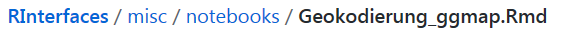
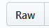

```{r setup, include=FALSE}
knitr::opts_chunk$set(echo = T)
```

## Aufgabe: Bearbeiten Sie ein Notebook weiter

- Suchen Sie [folgendes Notebook](https://raw.githubusercontent.com/Japhilko/RInterfaces/master/misc/notebooks/Geokodierung_ggmap.Rmd) auf meinem Github Ordner:



- Lassen Sie sich die Raw Version anzeigen



- Laden Sie das Notebook herunter:


- Und bearbeiten Sie es so weiter, dass sie die Geokodierung für eine Adresse bekommen, die für Sie interessant ist (Hbf, Hotel, Restaurant etc.)
