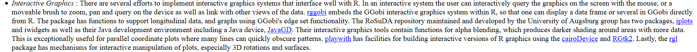
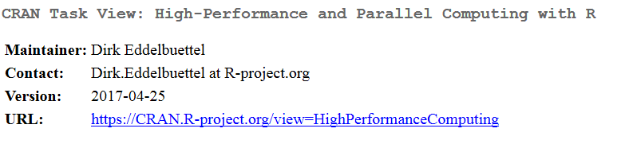
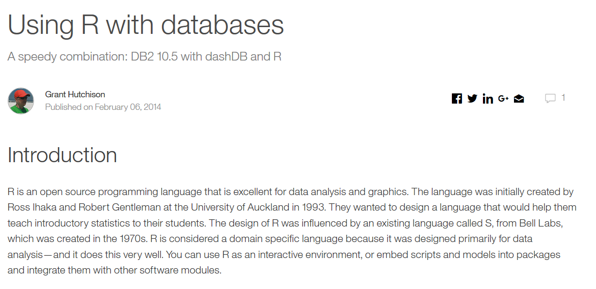

```{r, include=FALSE}
knitr::opts_chunk$set(echo = T)
```


## Aufgabe - Zusatzpakete

Gehen Sie auf <https://cran.r-project.org/> und suchen Sie in dem Bereich, wo die Pakete vorgestellt werden, nach Paketen,...

-  für Reproducible Research
-  für interaktive Darstellungen
-  für High-Performance Computing
-  um mit großen Datenmengen umzugehen

## [Die CRAN Task Views](https://cran.r-project.org/web/views/)

```{r,eval=F}
install.packages("ctv")
```

```{r}
library("ctv")
```

- alle Pakete installieren, die im CRAN Task View genannt werden:

```{r,eval=F}
install.views("ReproducibleResearch")
```

- wenn man das schon gemacht hat und alles auf den neuesten Stand bringen will:

```{r,eval=F}
update.views("ReproducibleResearch")
```

## [Interaktive Graphiken](https://cran.r-project.org/web/views/Graphics.html)

- es gibt einen Abschnitt im CRAN Task View Graphics:



## CRAN Task View zu [High-Performance Computing](https://cran.r-project.org/web/views/HighPerformanceComputing.html)




## Große Datenmengen

- [die Schnittstellen zu Datenbanken nutzen](https://www.ibm.com/developerworks/data/library/techarticle/dm-1402db2andr/)


